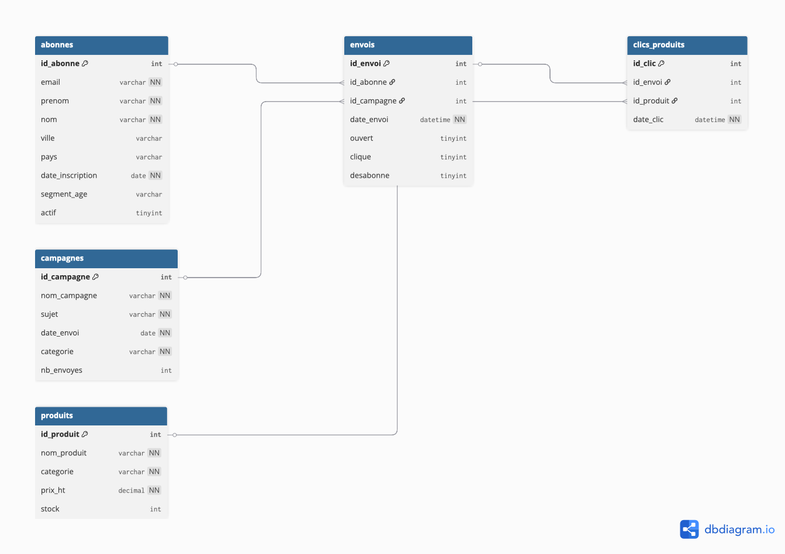

# Newsletter Engagement Scoring

**MSc2 Manager Data Marketing — Algo & Bases de Données 2026**  
Auteur : Kamilia Malih

---

## Problématique métier

Une marque e-commerce envoie une newsletter mensuelle à sa base d'abonnés. Après un an de campagnes, elle dispose de données comportementales riches : taux d'ouverture, taux de clic, désabonnements. La problématique est simple mais structurante : **comment identifier les abonnés réellement engagés et adapter la stratégie d'envoi à chaque segment ?**

L'enjeu est concret. Continuer à envoyer à toute la base sans distinction détériore la délivrabilité, pénalise le domaine expéditeur et gaspille les ressources. Un scoring d'engagement permet de concentrer les efforts sur les profils réceptifs, de relancer intelligemment les passifs, et d'accepter la perte des inactifs.

---

## Architecture du projet

```
newsletter-engagement-scoring/
├── sql/
│   ├── 01_create_db.sql          # Création de la base, tables, données
│   └── 02_queries_views_functions.sql  # Requêtes, vues, fonctions, procédures
├── python/
│   └── pipeline.py               # Pipeline complet (connexion → scoring → écriture)
├── dashboard/
│   └── app.py                    # Dashboard Plotly Dash interactif
├── .env.example                  # Variables d'environnement (modèle)
├── .gitignore
├── requirements.txt
└── README.md
```

---

## Schéma de la base de données



```
abonnes (1) ──< envois >── (1) campagnes
                  │
                  └──< clics_produits >── (1) produits
```

**5 tables, 2 relations many-to-many :**

| Table | Rôle | Lignes |
|---|---|---|
| `abonnes` | Base des abonnés avec données démographiques | 35 |
| `campagnes` | 12 campagnes newsletter envoyées en 2024 | 12 |
| `envois` | Table de liaison abonnés ↔ campagnes (comportements) | 420 |
| `produits` | Catalogue produits e-commerce | 20 |
| `clics_produits` | Table de liaison envois ↔ produits (clics sur produits) | 20 |

---

## Partie 1 — Base SQL

### Ce qui est implémenté

- Schéma dbdiagram.io avec 5 tables et relations
- Relations many-to-many : `abonnes` ↔ `campagnes` via `envois`, et `envois` ↔ `produits` via `clics_produits`
- Contraintes `FOREIGN KEY`, `NOT NULL`, `UNIQUE`
- 6 requêtes `SELECT` analytiques (WHERE, GROUP BY, HAVING, ORDER BY, LIMIT)
- Jointure sur 5 tables (abonnés → envois → clics_produits → produits → campagnes)
- CTE (`WITH stats_abonnes AS ...`) pour identifier les abonnés au-dessus de la moyenne de clic
- Vue `vue_engagement_abonnes` agrégeant tous les indicateurs par abonné
- Fonction `fn_score_engagement()` calculant un score pondéré (0–100)
- Procédure `sp_afficher_segments_engagement()` appliquant la segmentation

### Requête mise en avant (à présenter)

```sql
WITH stats_abonnes AS (
    SELECT
        a.id_abonne, a.prenom, a.nom,
        ROUND(100.0 * SUM(e.clique) / COUNT(e.id_envoi), 2) AS taux_clic
    FROM abonnes a
    JOIN envois e ON a.id_abonne = e.id_abonne
    GROUP BY a.id_abonne, a.prenom, a.nom
),
moyenne AS (
    SELECT ROUND(AVG(taux_clic), 2) AS moy_clic FROM stats_abonnes
)
SELECT s.prenom, s.nom, s.taux_clic, m.moy_clic,
       ROUND(s.taux_clic - m.moy_clic, 2) AS ecart_moyenne
FROM stats_abonnes s
CROSS JOIN moyenne m
WHERE s.taux_clic > m.moy_clic
ORDER BY s.taux_clic DESC;
```

Ce CTE à deux niveaux calcule d'abord les stats par abonné, puis la moyenne globale, avant de les croiser. C'est une façon élégante d'éviter une sous-requête corrélée.

---

## Partie 2 — Pipeline Python

### Fonctionnement

1. **Connexion MySQL** via `mysql-connector-python` et variables `.env`
2. **Extraction** depuis la vue `vue_engagement_abonnes` avec `pandas.read_sql`
3. **Enrichissement API** : appel à [REST Countries](https://restcountries.com/v3.1/) pour récupérer la région géographique de chaque pays (`region`, `subregion`)
4. **Scoring d'engagement** : algorithme maison pondéré (40 % ouverture + 60 % clic + bonus ancienneté + pénalités)
5. **Segmentation** en 4 niveaux : Champion / Actif / Passif / Inactif
6. **Écriture** dans la table `scoring_engagement` avec `ON DUPLICATE KEY UPDATE`

### Formule de scoring

```python
score = (taux_ouverture * 0.4) + (taux_clic * 0.6)
      + bonus_ancienneté   # jusqu'à +10 pts pour > 2 ans d'abonnement
      - pénalité_désabo    # -15 pts si désabonné
      - pénalité_inactivité # -10 pts si pas d'ouverture depuis > 90 jours
```

---

## Partie 3 — Dashboard interactif

Lancement :

```bash
python dashboard/app.py
# → http://127.0.0.1:8050
```

### Contenu du dashboard

**KPIs affichés (4) :**
- Nombre d'abonnés filtrés
- Score d'engagement moyen
- Taux d'ouverture moyen
- Taux de clic moyen

**Graphiques (4) :**
- Donut de répartition des segments (Champion / Actif / Passif / Inactif)
- Bar chart du score moyen par tranche d'âge
- Line chart des performances par campagne (taux ouverture + clic)
- Scatter plot taux ouverture vs score d'engagement (coloré par segment)

**Filtres interactifs (3) :**
- Dropdown multi-sélection : segment d'engagement
- Dropdown multi-sélection : tranche d'âge
- Slider : score minimum

**Callback** : un unique callback `update_dashboard()` écoute les 3 filtres et rafraîchit simultanément KPIs et graphiques.

---

## Installation

```bash
# 1. Cloner le dépôt
git clone https://github.com/<votre-pseudo>/newsletter-engagement-scoring.git
cd newsletter-engagement-scoring

# 2. Installer les dépendances
pip install -r requirements.txt

# 3. Configurer l'environnement
cp .env.example .env
# → éditer .env avec vos identifiants MySQL

# 4. Créer la base et insérer les données
mysql -u root -p < sql/01_create_db.sql
mysql -u root -p newsletter_scoring < sql/02_queries_views_functions.sql

# 5. Lancer le pipeline Python
python python/pipeline.py

# 6. Démarrer le dashboard
python dashboard/app.py
```

---

## Données

Données générées synthétiquement pour représenter une base d'abonnés newsletter réaliste : 35 abonnés, 12 campagnes mensuelles, 420 envois avec comportements variés (ouverture, clic, désabonnement).

---

## Sécurité

Le mot de passe MySQL est lu depuis un fichier `.env` non versionné. Le fichier `.gitignore` exclut `.env` du dépôt Git.
